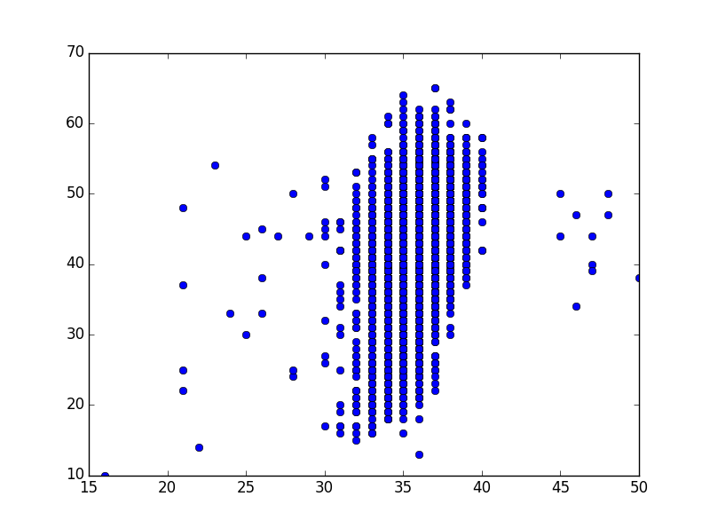
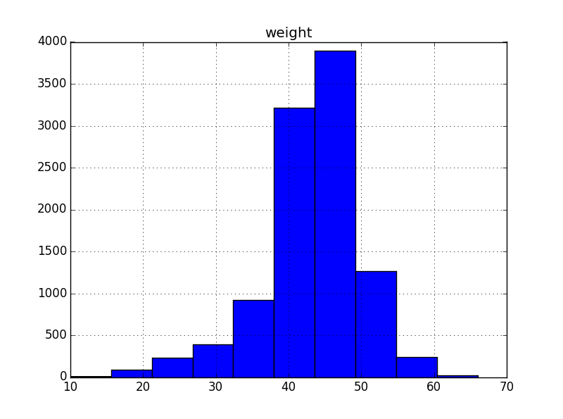

---
---

# Quick start with Python

Instructor: Philippe Marchand

## Why learn Python?

- High-level, interpreted language - simple programs can be written and
  tested quickly.
- Extensions like NumPy and SciPy support high-performance scientific 
  computing.
- Used in a wide range of domains, both in academia and industry.
- Large user community: it's easy to get help and to find free, 
  open-source packages for specialized problems.
  

## Data types and variables

As most programming languages, Python supports basic data types for integers
(`int`), real numbers (`float`), character strings (`str`) and logical 
True/False values (`bool`).

The type of a variable is automatically set when a value is assigned to it,
 using the `=` operator. It can be queried with the built-in `type()`
 function.
 
```python
i = 3
type(i)
```
{:.input}

```
<type 'int'>
```
{:.output}

Python supports the usual arithmetic operators:
 `+`, `-`, `*`, `/`, `**` (exponent)  
and comparison operators: 
 `==` (equal), `!=` (non-equal), `<`, `>`, `<=`, `>=` .
 
Both `int` and `float` values can be mixed within an expression; the result is a `float`.

```python
r = i + 1.5
print r, 'is of', type(r)
```
{:.input}

```
4.5 is of <type 'float'>
```
{:.output}

In the code above, we introduced the `print` statement, which prints the output
of multiple Python expressions on the same line, separated by spaces. 
Note that quoted character strings (here, 'is of') are printed as is. 

Let's define a new string variable.

```python
s = 'three'
type(s)
```
{:.input}

```
<type 'str'>
```
{:.output}


In Python, the same operator can perform different functions based on the
data types of the operands. See what happens if you "add" two character
strings.

```python
s + 'four'
```
{:.input}

```
'threefour'
```
{:.output}


## Lists

Python offers different types of objects to represent collections of values,
the most common being a *list*. It is created by listing multiple values or
variables, separated by commas and enclosed by square brackets.

```python
lst = [r, s, 'another string']
lst
```
{:.input}

```
[4.5, 'three', 'another string']
```
{:.output}


### List subsetting

You can retrieve individual elements of a list by their index; note that in 
Python, the first element has an index of 0.

```python
lst[1]
```
{:.input}

```
'three'
```
{:.output}

Negative indices are also possible: -1 is the last item in the list, 
-2 the second-to-last item, etc.

```python
lst[-1]
```
{:.input}

```
'another string'
```
{:.output}

The syntax `list[i:j]` selects a sub-list starting with the element at index
`i` and ending with the element at index `j - 1`.

```python
lst[0:2]
```
{:.input}

```
[4.5, 'three']
```
{:.output}

A blank space before or after the ":" indicates the start or end of the list,
respectively. For example, the previous example could have been written 
`lst[:2]`.


A potentially useful trick to remember the list subsetting rules in Python is
to picture the indices as "dividers" between list elements.

```
 0     1         2                  3 
 | 4.5 | 'three' | 'another string' |
-3    -2        -1
```

Positive indices are written at the top and negative indices at the bottom. 
`list[i]` returns the element to the right of `i` whereas `list[i:j]` returns
elements between `i` and `j`.

**Question**: Given any Python list, how can you retrieve its last two elements?

Lists can be nested within other lists: in this case, multiple sets of brackets
might be necessary to access individual elements.

```python
nested_list = [1, 2, 3, [11, 12, 13]]
nested_list[3][1]
```
{:.input}

```
12
```
{:.output}

### List methods

The Python language includes multiple functions that work with lists. 
Here are a few examples. Note that code lines starting with `#` are comments,
which serve to document the code but are ignored by the Python interpreter.

```python
# Returns the length of a list
len(lst)
```
{:.input}

```
3
```
{:.output}

```python
# Returns the position of an element in a list
lst.index(4.5)
```
{:.input}

```
0
```
{:.output}

```python
# Appends an element to the end of a list
lst.append(100)
lst
```
{:.input}

```
[4.5, 'three', 'another string', 100]
```
{:.output}

```python
# Reverse the order of a list's elements
lst.reverse()
lst
```
{:.input}

```
[100, 'another string', 'three', 4.5]
```
{:.output}

The last three examples feature a special type of functions called *methods*.
In object-oriented programming, methods belong to a specific object; in Python,
they are called with the `object.method()` syntax. In general, methods and 
functions operate in a similar manner; for example, `len()` could have been
a list method. 

Note that the `append` and `reverse` methods modify the `lst` object, and return
no value. A common mistake -- especially for those used to program in R --
would be to write `lst = lst.append(100)`, which overwrites `lst` with a null
value!

**Question**: What is the output of `len(lst[2])`? What does it mean?
(Like the `+` operator, this is another case of a function that behaves
differently depending of the type of data it's applied to.)


## Dictionaries

Lists are useful when you need to access elements by their position in a
sequence. In contrast, *dictionaries* make it easy to find values based on unique
identifiers called *keys*.

A dictionary is defined as a list of `key:value` pairs enclosed by curly
brackets. Individual values are accessed using square brackets, as for lists,
except that keys are used as the indices.

```python
animals = {'Snowy':'dog', 'Garfield':'cat', 'Bugs':'rabbit'}
animals['Bugs']
```
{:.input}

```
'rabbit'
```
{:.output}

To add an element to the dictionary, we "select" a new key and assign 
it a value.

```python
animals['Lassie'] = 'dog'
animals
```
{:.input}

```
{'Garfield': 'cat', 'Lassie': 'dog', 'Bugs': 'rabbit', 'Snowy': 'dog'}
```
{:.output}

Note that the keys of a dictionary must be unique. Assigning a value to an 
existing key would overwrite its previously associated value. As you can also
see from the example above, the order in which Python returns dictionary elements
is arbitrary.

**Question**: Based on what we have learned so far, how could you represent a
contact list in Python, i.e. a list of individuals with their names, phone 
numbers, email addresses, etc.?


## Loops and conditionals

A `for` loop takes a list and executes a block of code once for each
element of the list.

```python
for i in range(1, 5):
    j = i * 2
    print j
```
{:.input}

```
2
4
6
8
```
{:.output}

The `range(i, j)` function creates a list of integers from `i` to `j - 1`; just
like in the case of list slices, the upper bound is excluded. 

Note the pattern of the block above: the `for` statement is followed by a colon,
each line in the following block is indented at the same level, and there is no
delimiter or statement indicating the end of the block. Compared with other
programming languages where code indentation only serves to enhance readability, 
code blocks in Python are defined by changes in indentation. 

A `for` loop can be used to iterate over the elements of any list. In the
following example, we create a contact list (as a list of dictionaries), then
perform a loop over all contacts. Within the loop, we use a conditional 
statement (`if`) to check if the name is 'Ann'. If so, we print the phone 
number; if not (`else` block), we print the name.

```python
contacts = [ {'name': 'Ann', 'phone': '555-111-2222'},
             {'name': 'Bob', 'phone': '555-333-4444'} ]
for c in contacts:
    if c['name'] == 'Ann':
        print c['phone']
    else: 
        print c['name']
```
{:.input}

```
555-111-2222
Bob
```
{:.output}

**Exercise**: Write a loop that prints all even numbers between 1 and 9. 
Note:  if `i` is even, `i % 2 == 0`, where `%` is the modulo (or division
remainder) operator.


## Defining a function

We already saw examples of a few built-in functions, such as `type()` or `len()`.
You can define your own Python functions as a block of code starting with a `def`
statement.

```python
def add_2(num):
    result = num + 2
    return result

add_2(10)
```
{:.input}

```
12
```
{:.output}

The `def` keyword is followed by the function name, its arguments enclosed in
parentheses (separated by commas if there are more than one), and a colon. The
`return` statement passes the specified result as the output of the function. 
A simple `return` line with no output value just exits the function.

After it is defined, the function is invoked using its name and specifying the
arguments in parentheses, in the same order as in its definition.

**Exercise**: Create a function that takes a list as an argument and returns
its first and last elements as a new list.


## Python packages for scientific computing

So far we have only covered elements of the base Python language. However, most of
Python's useful tools for scientific programming can be found in packages that extend
its base functionalities. 

### NumPy

Because Python lists are meant to contain elements of any data type, they are not
so useful as numeric vectors. In particular, the `+` and `*` operations do not
perform numerical calculations when applied to lists, rather, they respectively 
concatenate and duplicate list elements.

```python
add_list = [1, 2] + [3, 4]
mult_list = [5, 6] * 2
print add_list, mult_list
```
{:.input}

```
[1, 2, 3, 4] [5, 6, 5, 6]
```
{:.output}

The **NumPy** package and its `array` type provide a solution to define vectors,
matrices and higher-dimension arrays.

```python
import numpy as np
vect = np.array([5, 20, 12])
vect
```
{:.input}

```
array([ 5, 20, 12])
```
{:.output}

The first line of this code, `import numpy as np`, gives Python access to functions
from the `numpy` package, using the `package.function` syntax. To save time typing 
package names, Python programmers often define short aliases for them, such as `np` 
here. This allows us to write `np.array` instead of `numpy.array` on the following 
line. 

The definition of the array itself looks much like a Python list, and array
subsetting follows the same conventions as list subsetting. The main difference is
for multidimensional arrays, where the indices in each dimensions can be 
separated by commas within one set of brackets. As an example, we create a 2 x 3
matrix and selected the first two columns.

```python
mat = np.array([[1, 2, 3], [4, 5, 6]])
mat[:, 0:2]
```
{:.input}

```
array([[1, 2],
       [4, 5]])
```
{:.output}


The initial ":" (with no indices) is interpreted as "select all rows".

Arithmetic operators and basic mathematical functions (e.g. exp, sqrt) are
applied element-wise to NumPy arrays.

```python
vect + np.array([1, 2, 3])
```
{:.input}

```
array([ 6, 22, 15])
```
{:.output}


```python
vect * 2
```
{:.input}

```
array([10, 40, 24])
```
{:.output}


```python
mat * vect
```
{:.input}

```
array([[  5,  40,  36],
       [ 20, 100,  72]])
```
{:.output}

In the last example, `vect` was multipled element-wise to each row of `mat`.To 
multiply a matrix and a vector (or two matrices, or two vectors in a dot-product), 
use the `dot` method.

```python
mat.dot(vect)   # Alternate syntax is np.dot(mat, vect)
```
{:.input}

```
array([ 81, 192])
```
{:.output}


### pandas

If you have used the statistical programming language R, you are familiar with
*data frames*, two-dimensional data structures where each column can hold a 
different type of data, as in a spreadsheet.

The data analysis library **pandas** provides a data frame object type for
Python, along with functions to subset, filter reshape and aggregate data
stored in data frames.
 
After importing pandas, we call its `read_csv` function to load the Portal 
surveys data from the file *surveys.csv*.

```python
import pandas as pd
surveys = pd.read_csv("data/surveys.csv")
surveys.head()
```
{:.input}

```
   record_id  month  day  year  plot_id species_id sex  hindfoot_length    weight
0          1      7   16  1977        2         NL   M               32       NaN
1          2      7   16  1977        3         NL   M               33       NaN
2          3      7   16  1977        2         DM   F               37       NaN
3          4      7   16  1977        7         DM   M               36       NaN
4          5      7   16  1977        3         DM   M               35       NaN

```
{:.output}

By default, the `head` method of a data frame shows its first five rows.
To select a subset of rows and columns from the data frame, we can use
the `loc` method, specifying a range of row indices and a list of 
column names. Note that unlike the usual way we specify number ranges in
Python, the end of the range (row 3) is *included* here.

```python
surveys.loc[1:3, ['plot_id', 'species_id']]
```
{:.input}

```
   plot_id species_id
1        3         NL
2        2         DM
3        7         DM
```
{:.output}

We can also select a whole column by writing its name in square brackets. Here,
we select the *weight* column and call the `describe` method to get summary
statistics for that column.

```python
surveys['weight'].describe()
```
{:.input}

```
count    32283.000000
mean        42.672428
std         36.631259
min          4.000000
25%         20.000000
50%         37.000000
75%         48.000000
max        280.000000
Name: weight, dtype: float64
```
{:.output}

The `loc` method can also filter rows, if we specify a logical condition in
place of the row indices. For example, here is how we could get the subset of
*surveys* where the species is "DM", and save it in a new data frame. Note 
that when we don't specify any column names after the comma, all columns are
kept.

```python
surveys_dm = surveys.loc[surveys['species_id'] == 'DM', ]
```
{:.input}

Another useful feature of pandas is the `groupby` method, which defines
groups of rows based on their values for a given variable. After grouping
a data frame, we can use statistical methods (like `mean`) to get summary
statistics by group.

```python
surveys_group = surveys_dm.groupby('sex')
surveys_group['hindfoot_length', 'weight'].mean()
```
{:.input}

```
     hindfoot_length     weight
sex
F          35.712692  41.609685
M          36.188229  44.353134

```
{:.output}

**Exercise**: Knowing that the `count` method (e.g. `surveys.count()`) returns the number of rows in a data frame, find which month had the most observations recorded
in *surveys*.


### matplotlib / pyplot

To complete this lesson, we will draw plots of our data using the 
**matplotlib** package and more specifically its **pyplot** subpackage.
The pandas package works particularly well with pyplot, since it defines
plotting methods that work specifically for data frames. 

In the following, we import pyplot, then call the `plot` method to create
a scatterplot of *weight* against *hindfoot_length* from the *surveys_dm*
data. The `plt.show()` function opens a new window showing the active plot.

```python
import matplotlib.pyplot as plt
surveys_dm.plot('hindfoot_length', 'weight', kind = 'scatter')
plt.show()
```
{:.input}




Besides `scatter`, the `plot` method supports other kinds of plots such
as bar and line graphs. To create the histogram of one variable from the data
frame, you may use a different method, `hist`.

```python
plt.close() # close the current plot to start a new one
surveys_dm.hist('weight')
plt.show()
```
{:.input}




## Additional resources

The material in this lesson is partly based on 
[Data Carpentry: Python for Ecologists](http://www.datacarpentry.org/python-ecology-lesson/) and the 
[Data Carpentry for Biologists](http://www.datacarpentry.org/semester-biology/) course. 
These are good resources for a more detailed overview of data analysis and scientific computing in Python.
